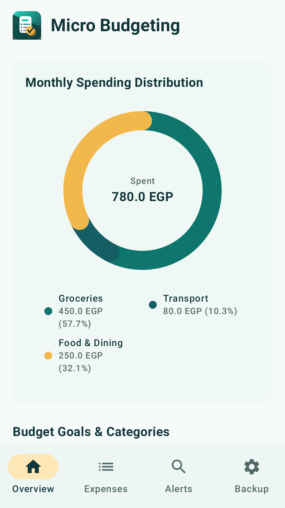
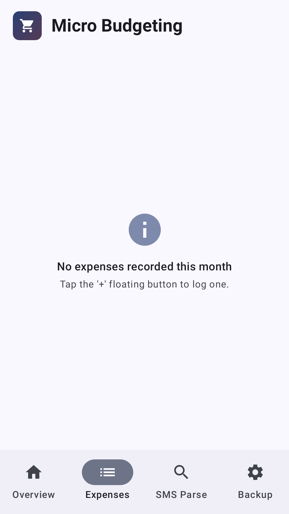
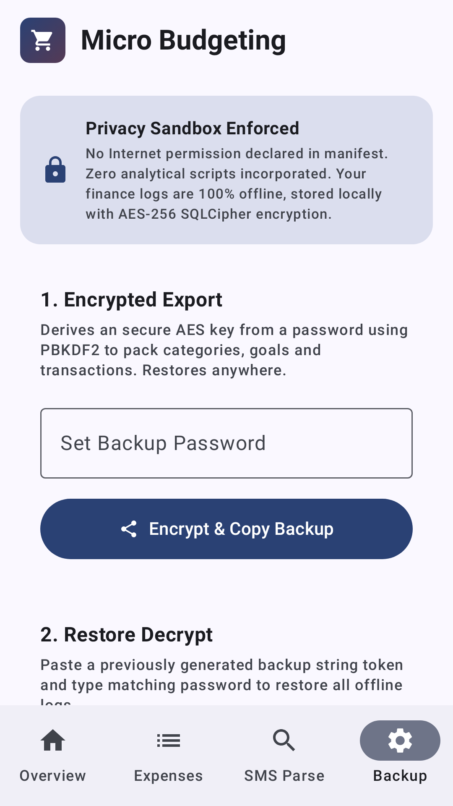
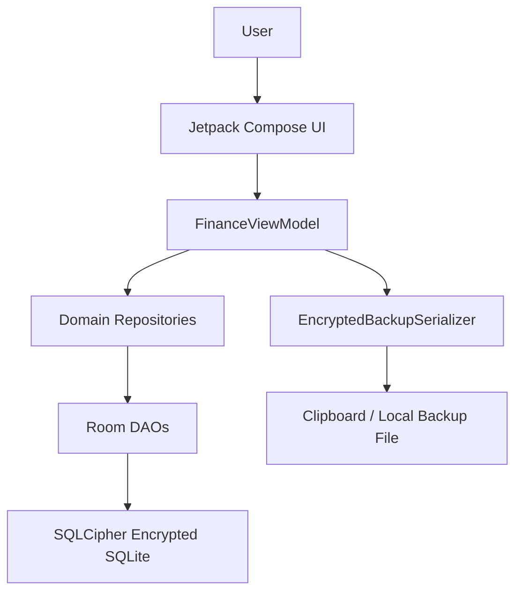

# Micro Budgeting

[](https://developer.android.com/)
[](https://kotlinlang.org/)
[](https://developer.android.com/compose)
[](app/build.gradle.kts)
[](#license)

## Project Overview

Micro Budgeting is an offline Android personal finance app for recording expenses, setting category budgets, and reviewing monthly spending patterns. It is designed for users who want a small, private budgeting tool without accounts, cloud sync, or internet access. The app stores financial data locally, encrypts the Room database with SQLCipher, and includes encrypted export/import backups.

<table>
  <tr>
    <td></td>
    <td></td>
    <td></td>
  </tr>
</table>

Demo link: Not configured.

## Key Features

- 🔒 Fully offline operation with no declared internet permission.
- 🧾 Manual expense tracking with amount, category, note, and date fields.
- 📊 Monthly budget summaries and spending visualizations.
- 🏷️ Default finance categories with icons and color badges.
- 🧮 Category spending caps for micro-budgeting workflows.
- 🗄️ SQLCipher-backed local Room database encryption.
- 🔐 Passphrase-protected encrypted backup export and import.
- 🖼️ Play Store screenshot and feature graphic generation through Roborazzi tests.

## Architecture Overview



### Components And Layers

- `MainActivity` owns the Compose entry point and creates `FinanceViewModel` through the AndroidX `viewModels` delegate.
- `presentation/` contains the Compose screens, charts, bottom navigation, backup UI, and user interaction state.
- `domain/` defines core models and repository interfaces for categories, budgets, and transactions.
- `data/repository/` maps Room entities to domain models and implements repository interfaces.
- `data/local/db/` defines Room entities, DAOs, and the SQLCipher-backed database.
- `data/backup/` serializes budget data with Moshi and encrypts backups with AES-GCM.

### Data Flow

1. The user records an expense or configures a budget in the Compose UI.
2. `FinanceViewModel` validates input and calls the relevant repository.
3. Repository implementations map domain models to Room entities.
4. Room persists data in `finance.db`, opened through SQLCipher on real devices.
5. UI state is refreshed from Kotlin `Flow` streams and rendered by Compose.

### Design Patterns

- MVVM for screen state and business actions.
- Repository interfaces for separating domain logic from Room persistence.
- Dependency container in `AppContainerImpl` for app-level wiring.
- Reactive `Flow` streams for month-filtered transaction and budget data.

## Tech Stack & Libraries

| Layer | Technology | Version | Purpose |
|---|---:|---:|---|
| Language | Kotlin | 2.2.10 | Android app implementation |
| Build | Android Gradle Plugin | 9.1.1 | Android build system |
| UI | Jetpack Compose Material 3 | Compose BOM 2024.09.00 | Declarative UI |
| Activity | AndroidX Activity Compose | 1.10.1 | Compose activity integration |
| ViewModel | AndroidX Lifecycle | 2.8.7 | UI state ownership |
| Navigation | AndroidX Navigation Compose | 2.8.9 | Navigation dependency, currently simple tab UI |
| Persistence | Room | 2.7.0 | SQLite abstraction and DAOs |
| Encryption | SQLCipher Android | 4.16.0 | Encrypted SQLite database |
| Key Storage | AndroidX Security Crypto | 1.1.0-alpha06 | MasterKey and encrypted preferences |
| JSON | Moshi | 1.15.2 | Backup payload serialization |
| Coroutines | Kotlinx Coroutines | 1.10.2 | Background work and flows |
| Screenshots | Roborazzi | 1.59.0 | Play Store screenshot generation |
| Tests | JUnit / Robolectric | 4.13.2 / 4.16.1 | JVM and Android runtime tests |

## Prerequisites

- macOS, Linux, or Windows with Android Studio installed.
- JDK 17. Android Studio's bundled JDK is recommended.
- Android SDK with platform 36.1 and build tools installed.
- An emulator or physical Android device for manual testing.
- Git for cloning and contributing.

| Variable | Required | Default | Description |
|---|---:|---|---|
| `KEYSTORE_PATH` | Release only | `my-upload-key.jks` | Path to the release upload keystore. |
| `STORE_PASSWORD` | Release only | Not configured | Release keystore password. |
| `KEY_PASSWORD` | Release only | Not configured | Release key password. |
| `GEMINI_API_KEY` | No | Not used | Present in `.env.example` from project scaffolding, but the app does not use Gemini APIs. |

## Installation & Setup

1. Clone the repository.

```bash
git clone https://github.com/michaelsam94/Micro-Budgeting.git
cd Micro-Budgeting
```

2. Open the project in Android Studio and let Gradle sync.

3. Confirm JDK 17 is selected for Gradle.

```bash
./gradlew --version
```

4. Build the debug APK.

```bash
./gradlew :app:assembleDebug
```

5. Install on a connected device or emulator.

```bash
adb install -r app/build/outputs/apk/debug/app-debug.apk
```

6. Run the app from Android Studio or launch it from the device.

Database setup: Not required. The app creates its local Room database on first launch.

Development server: Not applicable. This is a native Android app.

## Configuration

The main app configuration lives in `app/build.gradle.kts`:

- `applicationId`: `com.michael.microbudgeting`
- `minSdk`: `24`
- `targetSdk`: `36`
- `versionCode`: `3`
- `versionName`: `1.0.1`

Release signing is configured in `app/build.gradle.kts` and uses environment variables for keystore passwords. Gradle must be restarted or re-synced after changes to build files, dependencies, or signing settings.

The app does not declare internet, SMS, call log, contacts, location, camera, or microphone permissions.

## Usage / Quick Start

### Build And Launch A Debug APK

```bash
./gradlew :app:assembleDebug
adb install -r app/build/outputs/apk/debug/app-debug.apk
adb shell monkey -p com.michael.microbudgeting 1
```

### Run Startup And Unit Tests

```bash
./gradlew :app:testDebugUnitTest
```

The test suite includes `MainActivityLaunchTest`, which exercises app startup and helps catch launch-time crashes.

### Generate Play Store Assets

```bash
./gradlew generatePlayStoreAssets
```

Generated Play Store files are written under `play-store/`.

## API Reference

Not applicable. Micro Budgeting is a local Android application and does not expose an HTTP API, SDK, command-line API, or public service endpoint.

## Project Structure

```text
.
├── app/
│   ├── build.gradle.kts              # Android app module configuration
│   └── src/
│       ├── main/                     # App source, manifest, and resources
│       ├── test/                     # JVM, Robolectric, and screenshot tests
│       └── androidTest/              # Instrumented Android tests
├── gradle/
│   ├── libs.versions.toml            # Version catalog
│   └── wrapper/                      # Gradle wrapper files
├── play-store/
│   ├── listing-descriptions.md       # Store listing copy
│   ├── app-icon-512.png              # Google Play app icon
│   ├── feature-graphic.png           # Google Play feature graphic
│   ├── phone/                        # Phone screenshots
│   └── tablet/                       # Tablet screenshots
├── build.gradle.kts                  # Root Gradle plugins
├── settings.gradle.kts               # Gradle project settings
└── README.md                         # Project documentation
```

## Testing

### Unit And Robolectric Tests

```bash
./gradlew :app:testDebugUnitTest
```

Test locations:

- `app/src/test/java/com/michael/microbudgeting/`
- `app/src/test/java/com/michael/microbudgeting/playstore/`

Naming convention: JVM and Robolectric tests use `*Test.kt`; Play Store screenshot tests are grouped under the `PlayStoreScreenshotTests` category.

### Instrumented Tests

```bash
./gradlew :app:connectedDebugAndroidTest
```

Instrumented tests live in `app/src/androidTest/`.

### Screenshot And Store Asset Tests

```bash
./gradlew generatePlayStoreAssets
```

Roborazzi writes assets into `play-store/`.

### Coverage

Not configured. No JaCoCo, Kover, or hosted coverage report is present in the repository.

## Deployment

### Debug Builds

```bash
./gradlew :app:assembleDebug
```

Debug APK output:

```text
app/build/outputs/apk/debug/app-debug.apk
```

### Release Builds

Release signing expects a keystore and credentials:

```bash
export KEYSTORE_PATH=/absolute/path/to/my-upload-key.jks
export STORE_PASSWORD='your-store-password'
export KEY_PASSWORD='your-key-password'
./gradlew :app:bundleRelease
```

Release artifact output:

```text
app/build/outputs/bundle/release/app-release.aab
```

### Docker And Cloud

Not applicable. This repository builds a native Android app and has no Dockerfile, server process, or cloud deployment target.

### Health Check

Not applicable. There is no backend service. For app health, run unit tests, install the APK on a test device, and verify the app launches without crashing.

## Contributing

1. Fork the repository and create a focused branch.

```bash
git checkout -b feature/short-description
```

2. Use Conventional Commits where practical.

```text
feat: add budget category editing
fix: prevent startup crash on Android 15 devices
docs: update Play Store release notes
```

3. Run the relevant checks before opening a pull request.

```bash
./gradlew :app:testDebugUnitTest :app:assembleDebug
```

4. Keep pull requests small and include screenshots for UI changes.

PR checklist:

- Tests pass locally.
- New user-facing behavior is reflected in README or Play Store copy.
- No secrets, keystores, `.env`, or generated build outputs are committed.
- UI changes are verified on at least one phone-sized screen.

Style and lint rules: Kotlin official code style is enabled in `gradle.properties`. A separate `./docs/CONTRIBUTING.md` file is not configured.

## Roadmap

- [ ] Add editable custom categories from the app UI.
- [ ] Add recurring expense templates for common monthly transactions.
- [ ] Add export destination selection beyond clipboard and app files.
- [ ] Add more targeted ViewModel and repository tests.
- [ ] Add optional report filters by category and time period.

## License

License: Not configured. No license file is currently present in this repository.

Copyright © 2026 MichaelSam94.

## Acknowledgements & Credits

- Android, Kotlin, and Jetpack Compose for the app platform and UI toolkit.
- Room and AndroidX SQLite for local persistence.
- SQLCipher for encrypted local database storage.
- Moshi for JSON backup serialization.
- Roborazzi and Robolectric for screenshot and startup testing.
