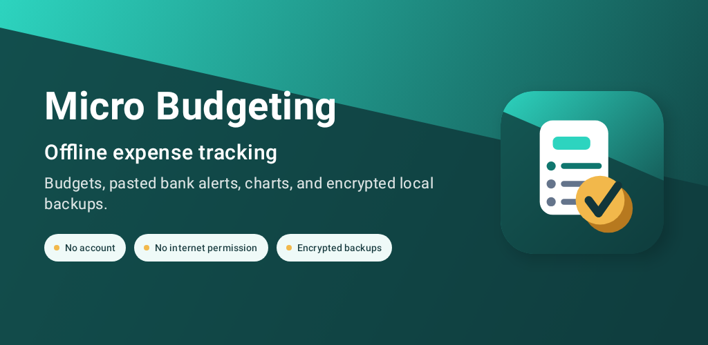
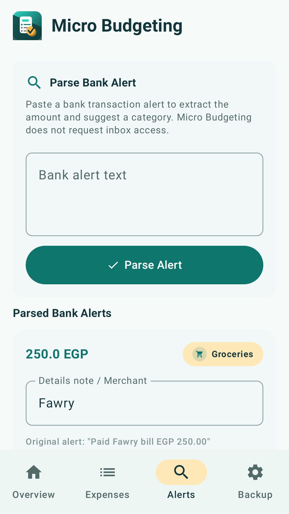
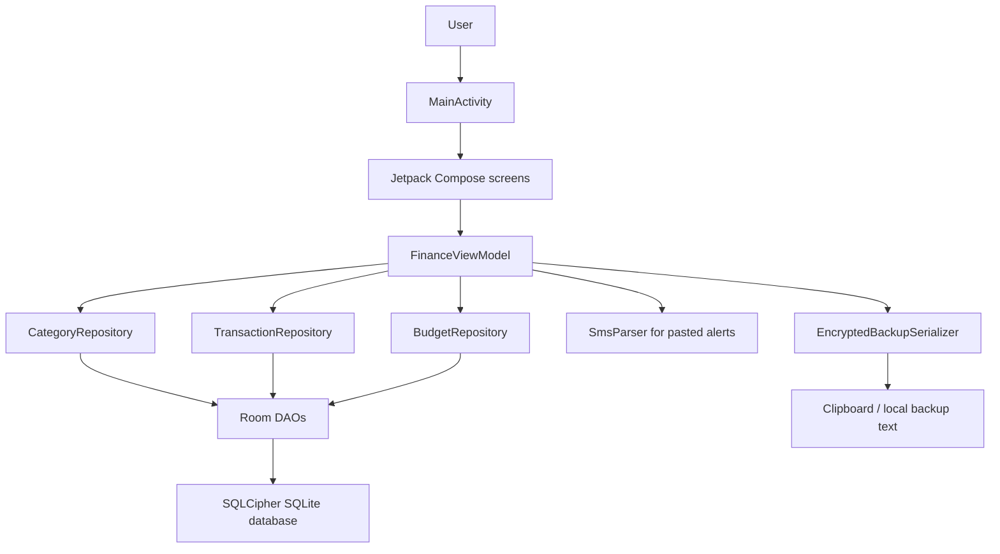

# Micro Budgeting



[](https://developer.android.com/)
[](https://kotlinlang.org/)
[](https://developer.android.com/compose)
[](app/build.gradle.kts)
[](#license)
[](https://github.com/michaelsam94/Micro-Budgeting/commits)
[](https://github.com/michaelsam94/Micro-Budgeting/issues)

Build status and coverage badges are not shown because this repository does not currently include CI or coverage
configuration.

## Project Overview

Micro Budgeting is an offline Android app for tracking everyday expenses, setting category budgets, and reviewing monthly
spending. It is built for people who want a small personal finance tool without accounts, cloud sync, bank connections, or
internet permission.

The app stores data locally, uses SQLCipher-backed Room storage on real devices, and supports passphrase-protected export
and import backups. Demo link: Not configured.

<table>
  <tr>
    <td></td>
    <td></td>
    <td></td>
  </tr>
</table>

## Key Features

- 🔒 Offline by design: the manifest declares no internet, SMS, contacts, location, camera, or microphone permissions.
- 🧾 Manual expense logging: add amount, category, note, and date for each transaction.
- 🏷️ Category budgets: set spending caps and track remaining budget by category and month.
- 📊 Spending charts: review monthly distribution and budget progress with Compose visualizations.
- 📨 Bank alert parsing: paste transaction alert text manually to extract an amount and suggested category for review.
- 🔐 Encrypted local backups: export and import budget data with passphrase-based AES-GCM encryption.
- 🎨 Store-ready branding: includes launcher icons, a feature graphic, phone screenshots, and tablet screenshots.
- 🧪 Screenshot automation: Roborazzi tests regenerate Play Store assets from deterministic seeded scenes.

## Architecture Overview



### Components And Layers

- `MainActivity` starts the Compose app, enables edge-to-edge drawing, and creates `FinanceViewModel`.
- `presentation/` contains tabs, dialogs, charts, bottom navigation, toolbar branding, and UI state rendering.
- `domain/` defines `Category`, `Transaction`, `Budget`, `BudgetSummary`, and repository interfaces.
- `data/repository/` maps Room entities to domain models and seeds default categories.
- `data/local/db/` contains Room entities, DAOs, and SQLCipher database setup.
- `data/sms/SmsParser.kt` parses manually pasted bank alert text; it does not read the device inbox.
- `data/backup/EncryptedBackupSerializer.kt` serializes backup payloads with Moshi and encrypts them with AES-GCM.
- `play-store/` contains listing copy, feature graphic, app icon, and generated screenshots.

### Data Flow

1. A user adds an expense, configures a budget, pastes a bank alert, or imports/exports a backup.
2. Compose UI events call `FinanceViewModel` methods.
3. The ViewModel validates input and delegates persistence work to repository interfaces.
4. Repository implementations write Room entities to the encrypted local database.
5. Room `Flow` streams feed updated categories, transactions, and budgets back to the UI.
6. Backup export serializes local data, encrypts it with a passphrase, and places the encoded payload where the user can
   copy or save it.

### Design Patterns

- MVVM for UI state, user actions, and lifecycle-aware data observation.
- Repository interfaces to separate domain behavior from Room persistence.
- A small dependency container in `AppContainerImpl` for application-level wiring.
- Reactive Kotlin `Flow` streams for month-scoped transaction and budget summaries.
- Test-only fixtures for deterministic Play Store screenshot generation.

## Tech Stack & Libraries

| Layer | Technology | Version | Purpose |
|---|---:|---:|---|
| Language | Kotlin | 2.2.10 | Android app implementation |
| Build | Android Gradle Plugin | 9.1.1 | Android build system |
| UI | Jetpack Compose Material 3 | Compose BOM 2024.09.00 | Declarative UI |
| Activity | AndroidX Activity Compose | 1.10.1 | Compose activity entry point |
| Lifecycle | AndroidX Lifecycle | 2.8.7 | ViewModel and lifecycle-aware state |
| Navigation | AndroidX Navigation Compose | 2.8.9 | Available dependency; current UI uses tabs |
| Persistence | Room | 2.7.0 | SQLite abstraction and DAO generation |
| SQLite | AndroidX SQLite | 2.6.2 | SQLite integration |
| Encryption | SQLCipher Android | 4.16.0 | Encrypted local database storage |
| Key Storage | AndroidX Security Crypto | 1.1.0-alpha06 | MasterKey and encrypted preferences |
| JSON | Moshi | 1.15.2 | Backup payload serialization |
| Networking libs | OkHttp / Retrofit | 4.10.0 / 2.12.0 | Present as dependencies, not used for app networking |
| Coroutines | Kotlinx Coroutines | 1.10.2 | Background work and Flow collection |
| Screenshots | Roborazzi | 1.59.0 | Play Store screenshot and feature graphic generation |
| JVM Android tests | Robolectric | 4.16.1 | Local Android runtime tests |
| Unit tests | JUnit | 4.13.2 | Test runner and assertions |

## Prerequisites

- macOS, Linux, or Windows.
- Android Studio or the Android SDK command-line tools.
- JDK 17. Android Studio's bundled JBR is recommended.
- Android SDK platform `36.1` for this project configuration.
- Git for cloning the repository.
- A connected Android device or emulator for install and instrumented tests.

| Variable | Required | Default | Description |
|---|---:|---|---|
| `KEYSTORE_PATH` | Release only | `my-upload-key.jks` | Release upload keystore path. |
| `STORE_PASSWORD` | Release only | From `key.properties` when present | Release keystore password. |
| `KEY_ALIAS` | Release only | `upload` | Release key alias. |
| `KEY_PASSWORD` | Release only | From `key.properties` when present | Release key password. |
| `GEMINI_API_KEY` | No | Value in `.env.example` | Scaffolding leftover; the app does not read this value or call Gemini APIs. |

## Installation & Setup

1. Clone the repository.

```bash
git clone https://github.com/michaelsam94/Micro-Budgeting.git
cd Micro-Budgeting
```

2. Open the project in Android Studio and let Gradle sync, or use the wrapper from the terminal.

```bash
./gradlew --version
```

3. Build a debug APK.

```bash
./gradlew :app:assembleDebug
```

4. Install the APK on a connected device or emulator.

```bash
adb install -r app/build/outputs/apk/debug/app-debug.apk
```

5. Launch the app.

```bash
adb shell monkey -p com.michael.microbudgeting 1
```

Database setup: Not required. The app creates its local Room database on first launch. Development server: Not
applicable because this is a native Android app.

## Configuration

The primary app configuration lives in `app/build.gradle.kts`:

- `namespace`: `com.michael.microbudgeting`
- `applicationId`: `com.michael.microbudgeting`
- `minSdk`: `24`
- `targetSdk`: `36`
- `compileSdk`: `36.1`
- `versionCode`: `5`
- `versionName`: `1.0.3`

Release signing is configured in the `signingConfigs.release` block. Credentials can come from environment variables or
from `key.properties`; keep keystores and passwords out of public repositories.

Theme and brand colors live in:

- `app/src/main/java/com/michael/microbudgeting/ui/theme/Color.kt`
- `app/src/main/java/com/michael/microbudgeting/ui/theme/Theme.kt`
- `app/src/main/res/values/colors.xml`

Launcher icons are stored under `app/src/main/res/mipmap-*`. Play Store copy and graphics are in `play-store/`.

Gradle restart or sync is required after changing build files, dependency versions, signing settings, or SDK versions.

## Usage / Quick Start

### Build, Install, And Launch

```bash
./gradlew :app:assembleDebug
adb install -r app/build/outputs/apk/debug/app-debug.apk
adb shell monkey -p com.michael.microbudgeting 1
```

### Generate A Signed Release Bundle

Set `STORE_PASSWORD` and `KEY_PASSWORD` in the shell or `key.properties` before running Gradle.

```bash
export KEYSTORE_PATH=/absolute/path/to/my-upload-key.jks
export KEY_ALIAS='upload'
./gradlew :app:bundleRelease
```

The release bundle is written to:

```text
app/build/outputs/bundle/release/app-release.aab
```

### Regenerate Play Store Assets

```bash
./gradlew generatePlayStoreAssets
```

Generated assets are written to:

```text
play-store/app-icon-512.png
play-store/feature-graphic.png
play-store/phone/
play-store/tablet/
```

## API Reference

Not applicable. Micro Budgeting is a local Android application and does not expose an HTTP API, SDK, command-line API, or
public service endpoint.

## Project Structure

```text
.
├── app/
│   ├── build.gradle.kts              # Android application module, signing, tests, dependencies
│   ├── proguard-rules.pro            # Release shrinker rules, currently minify disabled
│   └── src/
│       ├── main/
│       │   ├── AndroidManifest.xml   # App label, launcher activity, no dangerous permissions
│       │   ├── java/...              # Kotlin source for UI, domain, data, and DI layers
│       │   └── res/                  # Launcher icons, XML backup rules, strings, colors, themes
│       ├── test/                     # JVM, Robolectric, and Roborazzi screenshot tests
│       └── androidTest/              # Instrumented Android tests
├── gradle/
│   ├── libs.versions.toml            # Version catalog
│   └── wrapper/                      # Gradle wrapper files
├── play-store/
│   ├── app-icon-512.png              # Google Play app icon
│   ├── feature-graphic.png           # Google Play feature graphic
│   ├── listing-descriptions.md       # Store listing copy
│   ├── phone/                        # 1080x1920 phone screenshots
│   └── tablet/                       # 1600x2560 tablet screenshots
├── build.gradle.kts                  # Root Gradle plugin declarations
├── gradle.properties                 # Gradle, Kotlin, caching, and worker settings
├── metadata.json                     # Local project metadata
├── settings.gradle.kts               # Repository name and module inclusion
└── README.md                         # Project documentation
```

## Testing

### JVM And Robolectric Tests

```bash
./gradlew :app:testDebugUnitTest
```

Test locations:

- `app/src/test/java/com/michael/microbudgeting/`
- `app/src/test/java/com/michael/microbudgeting/playstore/`

Naming convention: JVM and Robolectric tests use `*Test.kt`. Play Store screenshot tests are marked with the
`PlayStoreScreenshotTests` JUnit category and are included when screenshot generation is requested.

### Instrumented Tests

```bash
./gradlew :app:connectedDebugAndroidTest
```

Instrumented tests live in `app/src/androidTest/`.

### Screenshot And Store Asset Tests

```bash
./gradlew generatePlayStoreAssets
```

This task runs Roborazzi and writes deterministic assets to `play-store/`.

### Coverage

Not configured. No JaCoCo, Kover, or hosted coverage report is present in this repository.

## Deployment

### Debug APK

```bash
./gradlew :app:assembleDebug
```

Output:

```text
app/build/outputs/apk/debug/app-debug.apk
```

### Release AAB For Google Play

```bash
./gradlew :app:bundleRelease
```

Output:

```text
app/build/outputs/bundle/release/app-release.aab
```

Before uploading to Play Console, confirm:

- `versionCode` is greater than the last uploaded bundle.
- The Play Store app name is `Micro Budgeting`.
- The installed app label is `Micro Budgeting`.
- Launcher icon, `play-store/app-icon-512.png`, and `play-store/feature-graphic.png` use matching branding.
- Listing copy in `play-store/listing-descriptions.md` matches the installed app behavior.

### Docker And Cloud

Not applicable. This repository builds a native Android app and has no Dockerfile, server process, cloud deployment
target, or backend health endpoint.

### Health Check

Not applicable for a server endpoint. For app health, run tests, install the APK on a test device, and verify that the
app launches and can add an expense, parse pasted alert text, and export/import a backup.

## Contributing

1. Fork the repository and create a focused branch.

```bash
git checkout -b feature/short-description
```

2. Use Conventional Commits where practical.

```text
feat: add category editing
fix: correct budget progress formatting
docs: refresh Play Store release notes
```

3. Run the relevant checks before opening a pull request.

```bash
./gradlew :app:testDebugUnitTest :app:assembleDebug
```

4. For UI or store asset changes, regenerate screenshots.

```bash
./gradlew generatePlayStoreAssets
```

PR checklist:

- Tests pass locally.
- User-facing behavior is reflected in README or Play Store copy.
- No secrets, keystores, `.env`, or generated build outputs are committed unless intentionally managed elsewhere.
- UI changes are checked on at least one phone-sized screen.
- Release changes include an appropriate `versionCode` bump.

Style and lint rules: Kotlin official code style is enabled in `gradle.properties`. A separate
`./docs/CONTRIBUTING.md` file is not configured.

## Roadmap

- [ ] Add editable custom categories from the app UI.
- [ ] Add recurring expense templates for common monthly transactions.
- [ ] Add export destination selection beyond clipboard and app-managed text.
- [ ] Add more focused ViewModel, repository, and backup serializer tests.
- [ ] Add optional filters by category, source, and date range.

## License

License: Not configured. No license file is currently present in this repository.

Copyright (c) 2026 MichaelSam94.

## Acknowledgements & Credits

- Android, Kotlin, and Jetpack Compose for the application platform and UI toolkit.
- Room and AndroidX SQLite for local persistence.
- SQLCipher for encrypted SQLite storage.
- AndroidX Security Crypto for local key management.
- Moshi for backup JSON serialization.
- Roborazzi and Robolectric for screenshot generation and local Android tests.
